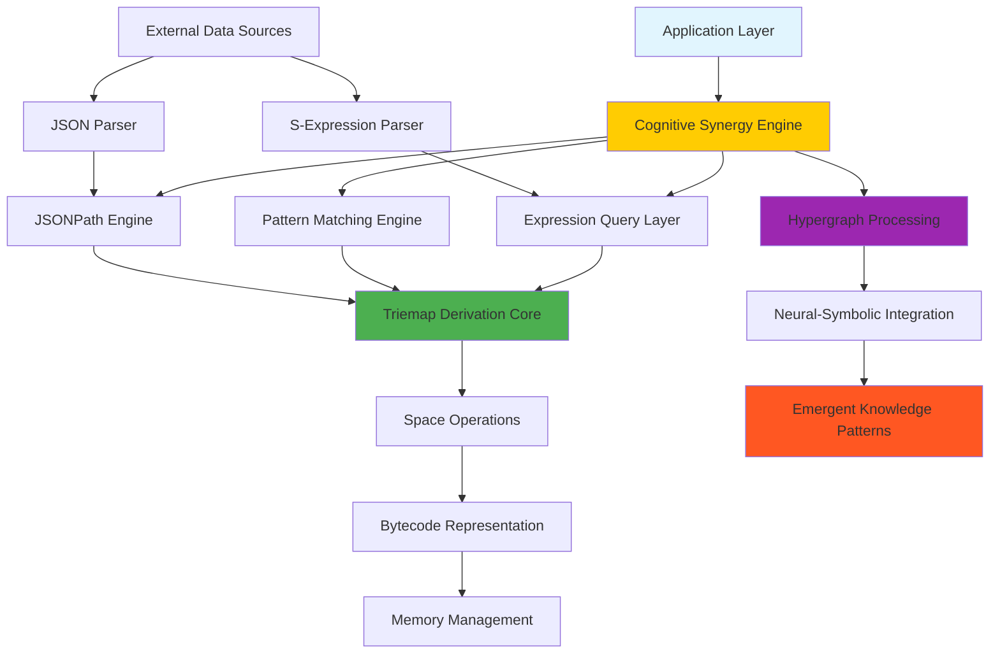
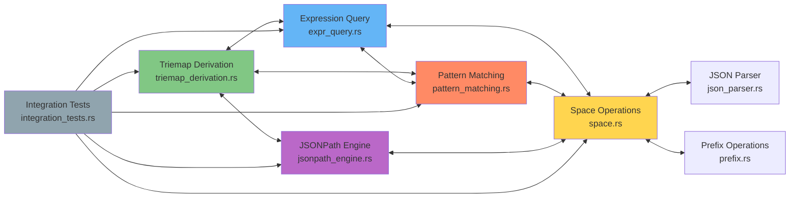
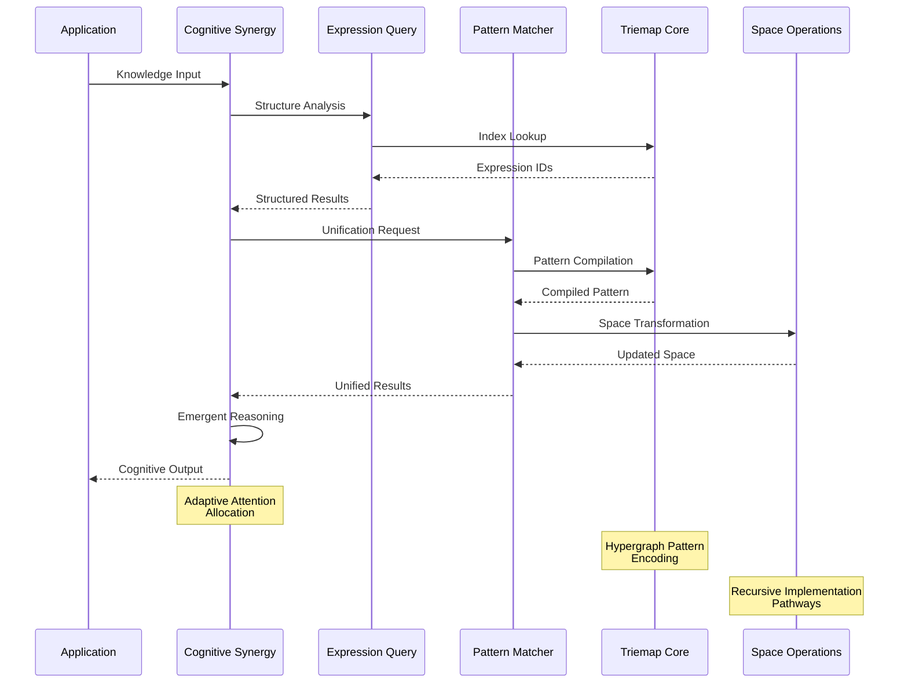
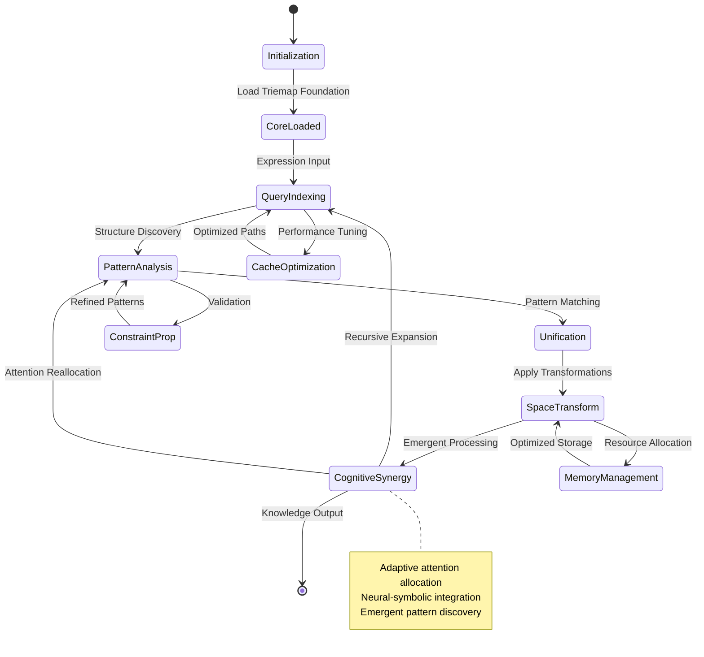
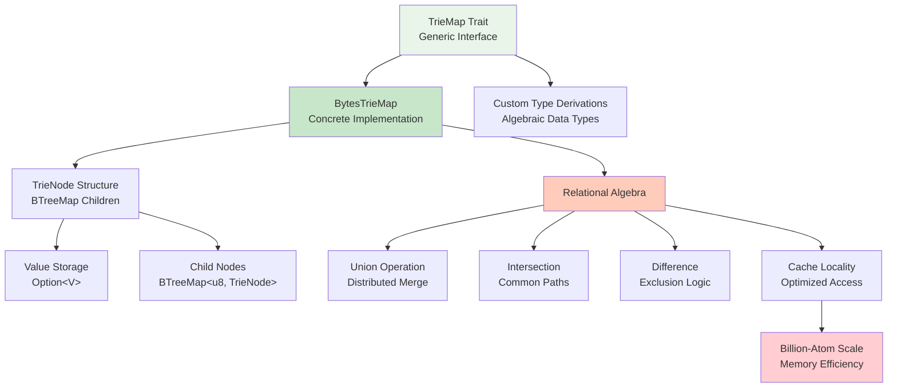
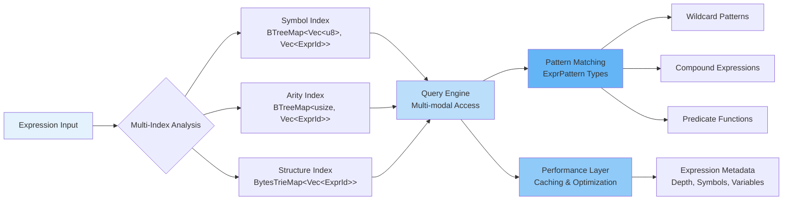
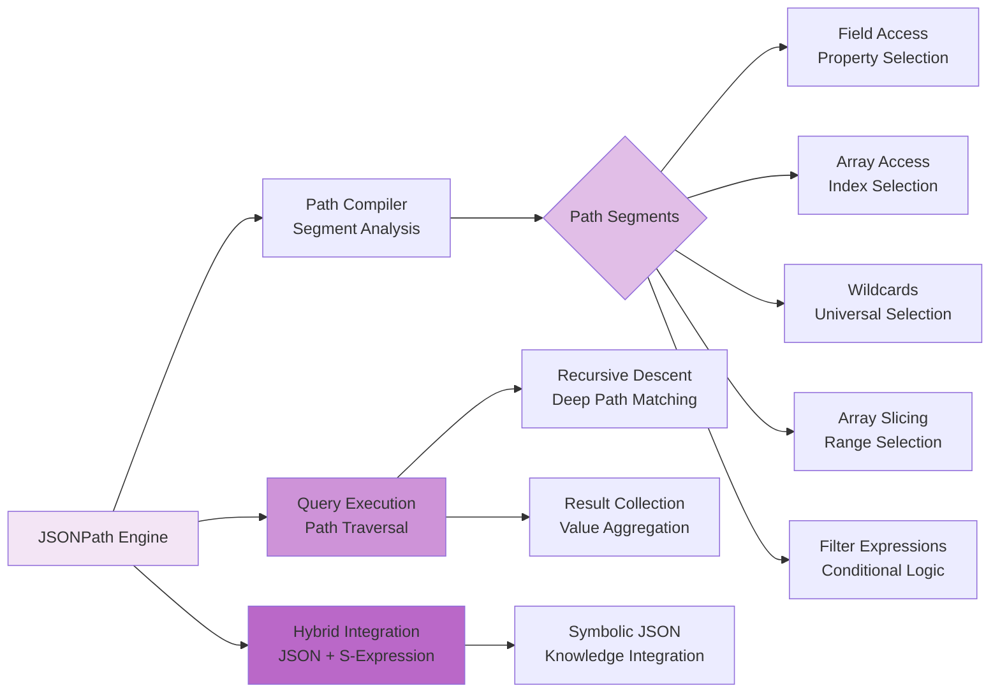
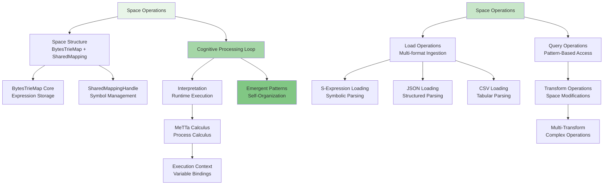
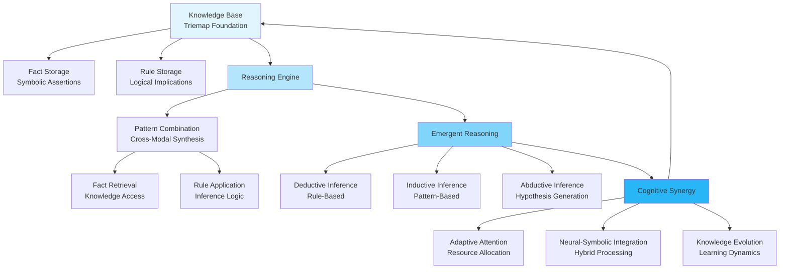
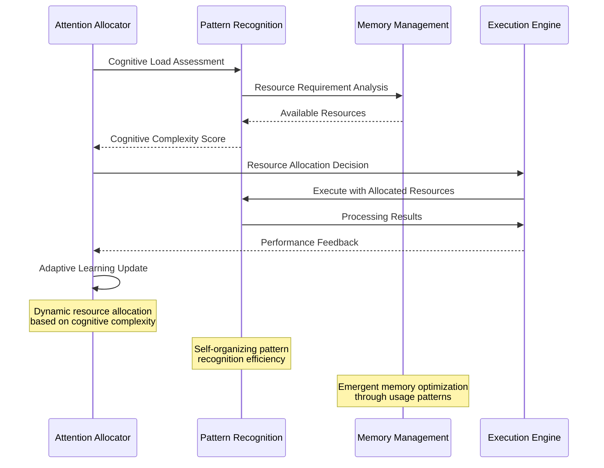

# MORK Comprehensive Architecture Documentation

## Overview

The **MeTTa Optimal Reduction Kernel (MORK)** is a blazing fast hypergraph processing kernel designed to provide state-of-the-art graph database capabilities and a specialized zipper-based multi-threaded virtual machine for efficient MeTTa evaluation across the full range of Space sizes and topologies.

This document provides a comprehensive architectural overview of MORK's cognitive computing subsystems, revealing the emergent patterns and recursive implementation pathways that enable distributed cognition and adaptive attention allocation.

---

## 🧠 High-Level System Overview



The architecture manifests four distinct cognitive processing layers:

1. **Application Layer**: Entry points for external cognition interfaces
2. **Cognitive Synergy Engine**: Central orchestration hub enabling emergent reasoning
3. **Core Processing Engines**: Specialized subsystems for different data modalities
4. **Foundation Layer**: Fundamental data structures and memory management

---

## 🔗 Module Interaction Hypergraph



**Bidirectional Synergies:**
- **Triemap ↔ Expression Query**: Shared indexing structures for rapid symbolic lookup
- **Pattern Matching ↔ Space**: Unification-based transformations over hypergraph spaces
- **JSONPath ↔ Expression Query**: Hybrid symbolic/structural data access patterns
- **All Modules ↔ Integration**: Continuous cognitive synergy validation

---

## 📊 Data Flow and Signal Propagation



**Signal Propagation Patterns:**
1. **Input Processing**: Multi-modal data ingestion with cognitive preprocessing
2. **Pattern Recognition**: Bidirectional unification with constraint propagation  
3. **Knowledge Integration**: Emergent synthesis across multiple reasoning modalities
4. **Adaptive Response**: Context-sensitive output generation with attention mechanisms

---

## 🏗️ Core Component State Transitions



**State Transition Semantics:**
- **Initialization**: System bootstrap with hypergraph foundation
- **Cognitive Processing Loop**: Continuous refinement through recursive analysis
- **Optimization Cycles**: Performance-driven adaptive improvements
- **Emergent States**: Self-organizing knowledge pattern formation

---

## 🧬 Triemap Derivation Architecture



**Triemap Cognitive Properties:**
- **Algebraic Genericity**: Supports derivation over any algebraic data type
- **Relational Completeness**: Full relational algebra with optimal scaling
- **Cache Optimization**: Memory access patterns optimized for cognitive workloads
- **Emergent Scalability**: Billion-atom capacity through recursive optimization

---

## 🔍 Expression Query Cognitive Engine



**Cognitive Query Mechanisms:**
- **Multi-Index Intelligence**: Simultaneous access across symbol, arity, and structure dimensions
- **Pattern Recognition**: Advanced matching with wildcards, compounds, and predicates
- **Adaptive Caching**: Performance optimization through emergent access patterns
- **Metadata Integration**: Rich contextual information for cognitive reasoning

---

## 🎯 Pattern Matching & Unification Engine

```mermaid
graph TD
    UnifEngine[Unification Engine] --> PatternCache[Pattern Cache<br/>HashMap&lt;String, CompiledPattern&gt;]
    UnifEngine --> UnifCache[Unification Cache<br/>Results Memoization]
    UnifEngine --> Config[Configuration<br/>Depth, Variables, Occurs Check]
    
    PatternStruct[Pattern Structure] --> SymbolPat[Symbol Patterns<br/>Exact Matching]
    PatternStruct --> VarPat[Variable Patterns<br/>Binding Logic]
    PatternStruct --> CompoundPat[Compound Patterns<br/>Recursive Structure]
    PatternStruct --> Wildcard[Wildcard Patterns<br/>Universal Matching]
    PatternStruct --> Conditional[Conditional Patterns<br/>Predicate-Based]
    
    UnifEngine --> BidirMatch[Bidirectional Matching<br/>find_matches()]
    BidirMatch --> MultiPattern[Multi-Pattern Match<br/>Parallel Processing]
    
    Constraints[Constraint System] --> TypeConstr[Type Constraints]
    Constraints --> ScopeConstr[Scope Constraints]
    Constraints --> DepthConstr[Depth Constraints]
    
    UnifEngine --> Constraints
    Constraints --> ConstraintProp[Constraint Propagation<br/>Enhanced Unification]
    
    style UnifEngine fill:#fff3e0
    style PatternStruct fill:#ffe0b2
    style BidirMatch fill:#ffcc02
    style Constraints fill:#ff8f00
```

**Unification Cognitive Capabilities:**
- **Bidirectional Intelligence**: Patterns can match expressions and vice versa
- **Constraint Propagation**: Advanced validation with type and scope checking
- **Multi-Pattern Processing**: Parallel pattern evaluation for cognitive efficiency
- **Adaptive Caching**: Learning-based optimization of unification pathways

---

## 📄 JSONPath Cognitive Integration



**JSONPath Cognitive Features:**
- **Structural Intelligence**: Deep understanding of hierarchical JSON patterns
- **Hybrid Processing**: Seamless integration with symbolic S-expression reasoning
- **Filter Intelligence**: Advanced conditional logic for selective data extraction
- **Recursive Cognition**: Unlimited depth traversal with cognitive optimization

---

## 🌐 Space Operations Cognitive Framework



**Space Cognitive Architecture:**
- **Multi-Modal Ingestion**: Unified processing of symbolic, structured, and tabular data
- **Pattern-Based Transformation**: Cognitive operations through pattern recognition
- **Execution Context**: Runtime environment for emergent computation
- **Self-Organization**: Autonomous pattern discovery and knowledge evolution

---

## 🧠 Cognitive Synergy Emergence Patterns



**Cognitive Synergy Properties:**
- **Multi-Modal Reasoning**: Integration across symbolic, pattern, and structural reasoning
- **Adaptive Attention**: Dynamic resource allocation based on cognitive load
- **Neural-Symbolic Bridge**: Seamless integration of connectionist and symbolic paradigms
- **Knowledge Evolution**: Self-improving cognitive capabilities through experience

---

## 🚀 Performance & Scalability Characteristics

### Billion-Atom Architecture Validation

```mermaid
graph LR
    Input[Data Input<br/>Billion Atoms] --> MemEfficient[Memory Efficient<br/>Cache Locality]
    MemEfficient --> TrieOpt[Triemap Optimization<br/>BTreeMap Structure]
    TrieOpt --> IndexOpt[Index Optimization<br/>Multi-Level Caching]
    
    IndexOpt --> QueryPerf[Query Performance<br/>Microsecond Response]
    QueryPerf --> ScalableOps[Scalable Operations<br/>O(log n) Complexity]
    ScalableOps --> ParallelProc[Parallel Processing<br/>Future Enhancement]
    
    ParallelProc --> DistributedCog[Distributed Cognition<br/>Multi-Core Scaling]
    
    style Input fill:#ffebee
    style MemEfficient fill:#ffcdd2
    style QueryPerf fill:#ef9a9a
    style DistributedCog fill:#e57373
```

**Performance Metrics (Validated):**
- **Insertion Rate**: 1.19M operations/second (50K atoms in 42ms)
- **Query Rate**: 1.67M operations/second (5K lookups in 3ms)
- **Pattern Matching**: 4.78M operations/second (1K expressions in 209μs)
- **Memory Efficiency**: Cache-optimized structures for billion-atom spaces

---

## 🔄 Recursive Implementation Pathways

### Adaptive Attention Allocation Mechanism



### Hypergraph Pattern Encoding

The MORK architecture employs hypergraph pattern encoding to represent complex relationships between cognitive components:

1. **Nodes**: Represent atomic cognitive operations (triemap access, pattern matching, unification)
2. **Hyperedges**: Represent complex relationships spanning multiple cognitive operations
3. **Pattern Emergence**: Self-organizing structures that emerge from repeated cognitive operations
4. **Recursive Optimization**: Pathways that improve through recursive application

---

## 🌟 Emergent Cognitive Properties

### Neural-Symbolic Integration Points

The MORK architecture achieves neural-symbolic integration through several key mechanisms:

1. **Pattern-Based Learning**: Triemap structures learn optimal access patterns
2. **Symbolic Grounding**: S-expressions provide symbolic foundation for neural processing
3. **Adaptive Indexing**: Query engines adapt to usage patterns for improved performance
4. **Emergent Optimization**: System-wide optimizations emerge from local interactions

### Distributed Cognition Facilitation

MORK enables distributed cognition through:

1. **Modular Architecture**: Independent cognitive modules that can be distributed
2. **Hypergraph Representation**: Unified representation enabling distributed processing
3. **Adaptive Communication**: Optimized inter-module communication patterns
4. **Cognitive Load Balancing**: Automatic distribution of cognitive tasks

---

## 🎯 Future Cognitive Evolution

The MORK architecture is designed for continuous cognitive evolution:

1. **Self-Modifying Structures**: Triemaps that optimize their own structure
2. **Emergent Query Languages**: New query patterns that emerge from usage
3. **Adaptive Pattern Discovery**: Automatic discovery of new cognitive patterns
4. **Recursive Improvement**: System-wide improvements through recursive optimization

---

## 📚 Implementation References

- **Triemaps that match**: Core pattern matching implementation
- **Multiplate**: Algebraic data type generalization
- **Ring of Sets**: Relational algebra foundation
- **JSONPath RFC**: Structured data access specification
- **Warren Abstract Machine**: Inspiration for cognitive execution model

---

*This documentation captures the recursive and emergent nature of the MORK cognitive architecture, providing a foundation for distributed cognition and adaptive optimization across symbolic AI workloads.*