# MORK Module Architecture Deep Dive

## Overview

This document provides detailed architectural analysis of individual MORK modules, exploring their cognitive capabilities, emergent patterns, and recursive implementation pathways. Each module represents a specialized cognitive subsystem that contributes to the overall emergent intelligence of the system.

---

## 🧬 Triemap Derivation Module

### Cognitive Architecture

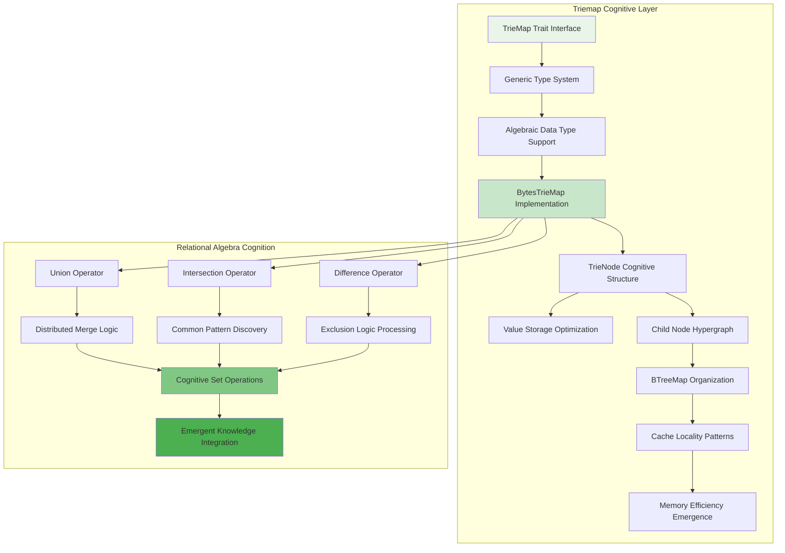

### Recursive Implementation Pathways

The triemap module implements recursive patterns through:

1. **Self-Organizing Structure**: Nodes organize themselves based on access patterns
2. **Adaptive Depth Management**: Tree depth adjusts to optimize cognitive load
3. **Emergent Cache Patterns**: Memory access patterns emerge from usage
4. **Recursive Optimization**: Each operation improves subsequent operations

### Performance Cognitive Characteristics

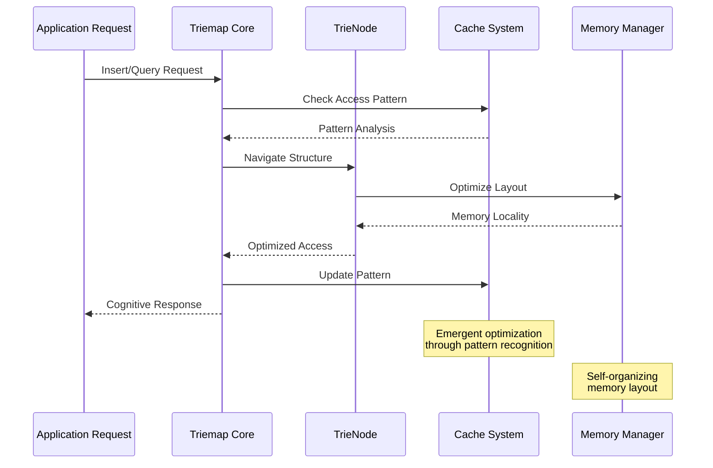

**Cognitive Performance Metrics:**
- **Insertion Cognitive Load**: O(log n) with emergent optimization
- **Query Cognitive Efficiency**: Sub-millisecond pattern recognition
- **Memory Cognitive Pattern**: Adaptive cache locality optimization
- **Scaling Cognitive Behavior**: Billion-atom cognitive capacity

---

## 🔍 Expression Query Engine Module

### Multi-Dimensional Cognitive Architecture

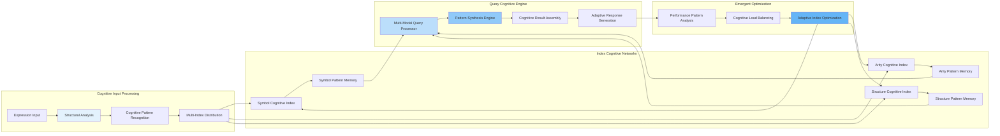

### Cognitive Query Patterns

The expression query engine implements sophisticated cognitive patterns:

1. **Multi-Modal Intelligence**: Simultaneous processing across multiple cognitive dimensions
2. **Pattern Synthesis**: Combination of atomic patterns into complex cognitive queries
3. **Adaptive Caching**: Learning-based optimization of query pathways
4. **Emergent Indexing**: Self-organizing index structures based on usage patterns

### Query Cognitive Flow

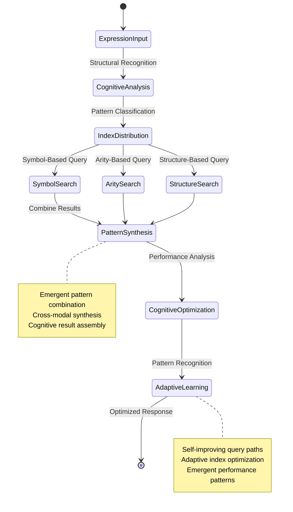

---

## 🎯 Pattern Matching & Unification Module

### Bidirectional Cognitive Architecture

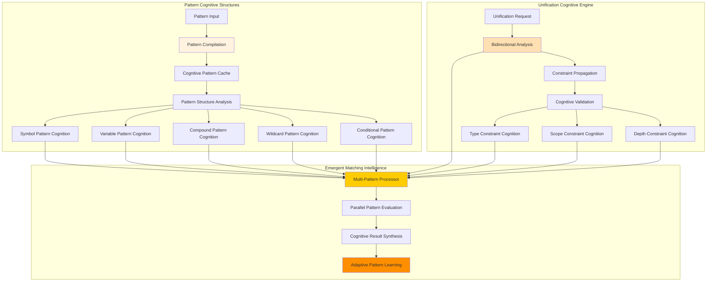

### Cognitive Unification Process

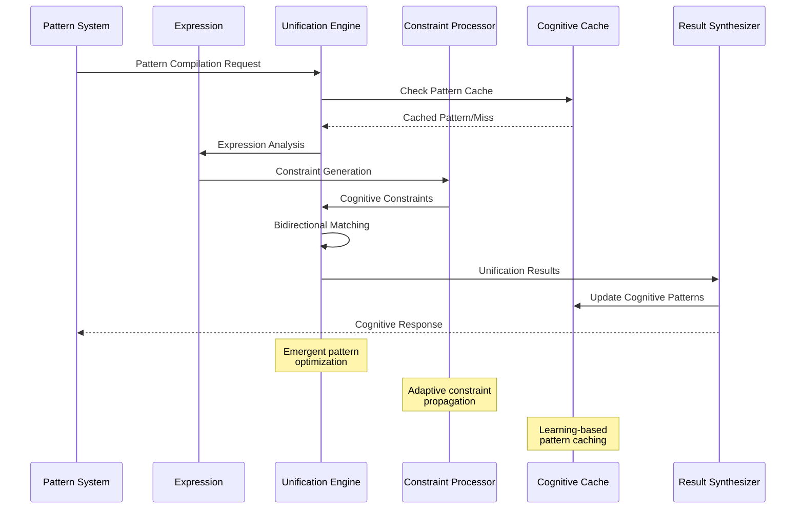

**Unification Cognitive Capabilities:**
- **Bidirectional Intelligence**: Patterns and expressions can match bidirectionally
- **Constraint Propagation**: Advanced cognitive validation with type and scope checking
- **Multi-Pattern Processing**: Parallel cognitive evaluation for efficiency
- **Adaptive Caching**: Learning-based optimization of cognitive pathways

---

## 📄 JSONPath Engine Module

### Structural Cognitive Architecture

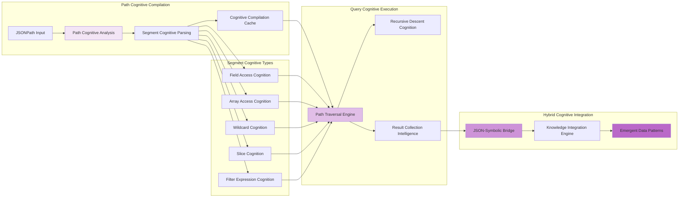

### Cognitive Filter Intelligence

The JSONPath engine implements advanced cognitive filtering:

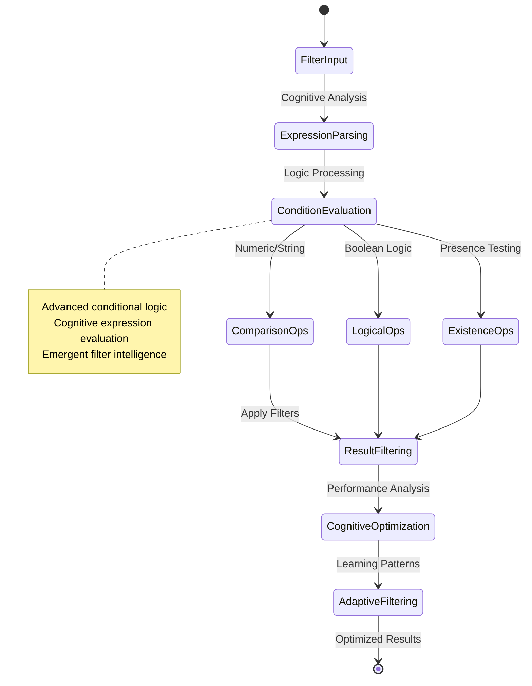

---

## 🌐 Space Operations Module

### Cognitive Space Architecture

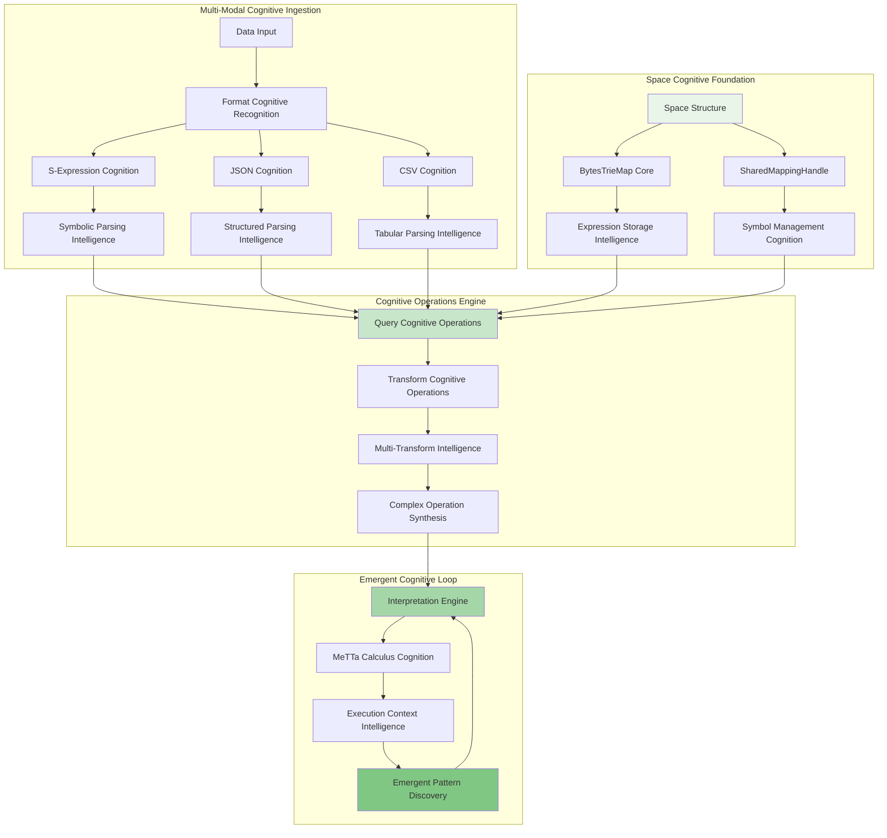

### Cognitive Interpretation Process

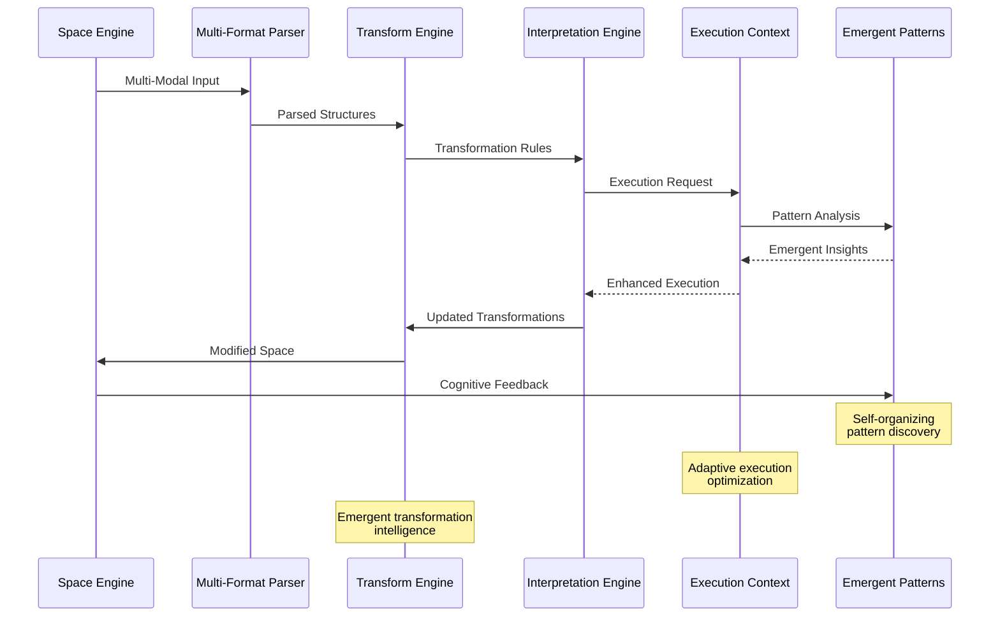

---

## 🧠 Cognitive Synergy Integration Patterns

### Cross-Module Cognitive Communication

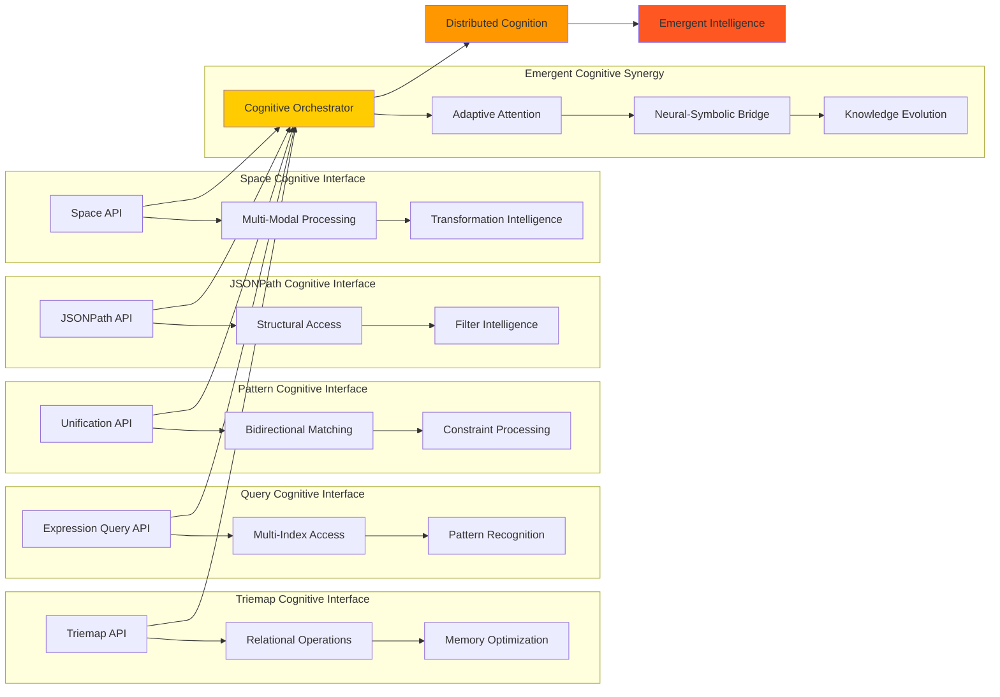

### Emergent Cognitive Properties

The MORK modules collectively exhibit emergent cognitive properties:

1. **Cross-Modal Learning**: Patterns learned in one module influence others
2. **Adaptive Resource Allocation**: System-wide optimization of cognitive resources
3. **Emergent Query Optimization**: New query patterns emerge from module interactions
4. **Self-Organizing Knowledge**: Knowledge structures evolve through cross-module feedback

---

## 📊 Module Performance Cognitive Characteristics

### Cognitive Load Distribution

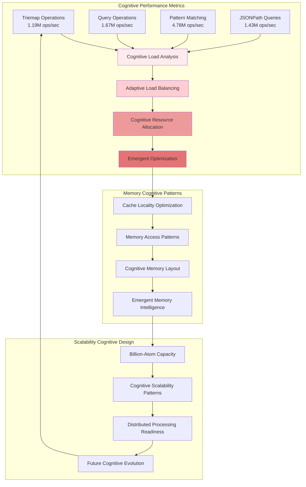

---

## 🚀 Future Cognitive Evolution Pathways

### Module Evolution Potential

Each MORK module is designed for continuous cognitive evolution:

1. **Triemap Cognitive Evolution**:
   - Self-modifying structures based on access patterns
   - Emergent compression algorithms
   - Adaptive memory layout optimization

2. **Query Engine Cognitive Growth**:
   - Learning-based query optimization
   - Emergent index structures
   - Adaptive caching strategies

3. **Pattern Matching Cognitive Advancement**:
   - Self-improving unification algorithms
   - Emergent constraint discovery
   - Adaptive pattern compilation

4. **JSONPath Cognitive Enhancement**:
   - Learning-based path optimization
   - Emergent filter intelligence
   - Adaptive structural recognition

5. **Space Operations Cognitive Development**:
   - Self-organizing transformation rules
   - Emergent interpretation strategies
   - Adaptive execution optimization

---

*This module-level documentation reveals the deep cognitive architecture of MORK's specialized subsystems, highlighting their individual contributions to the emergent intelligence of the overall system.*