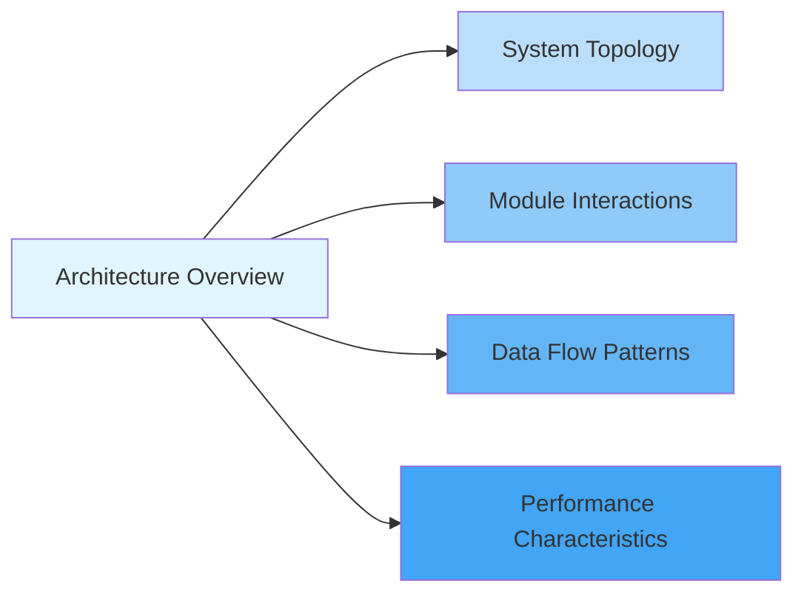
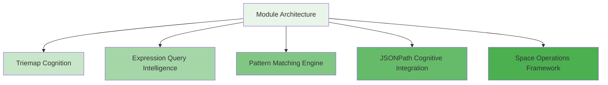
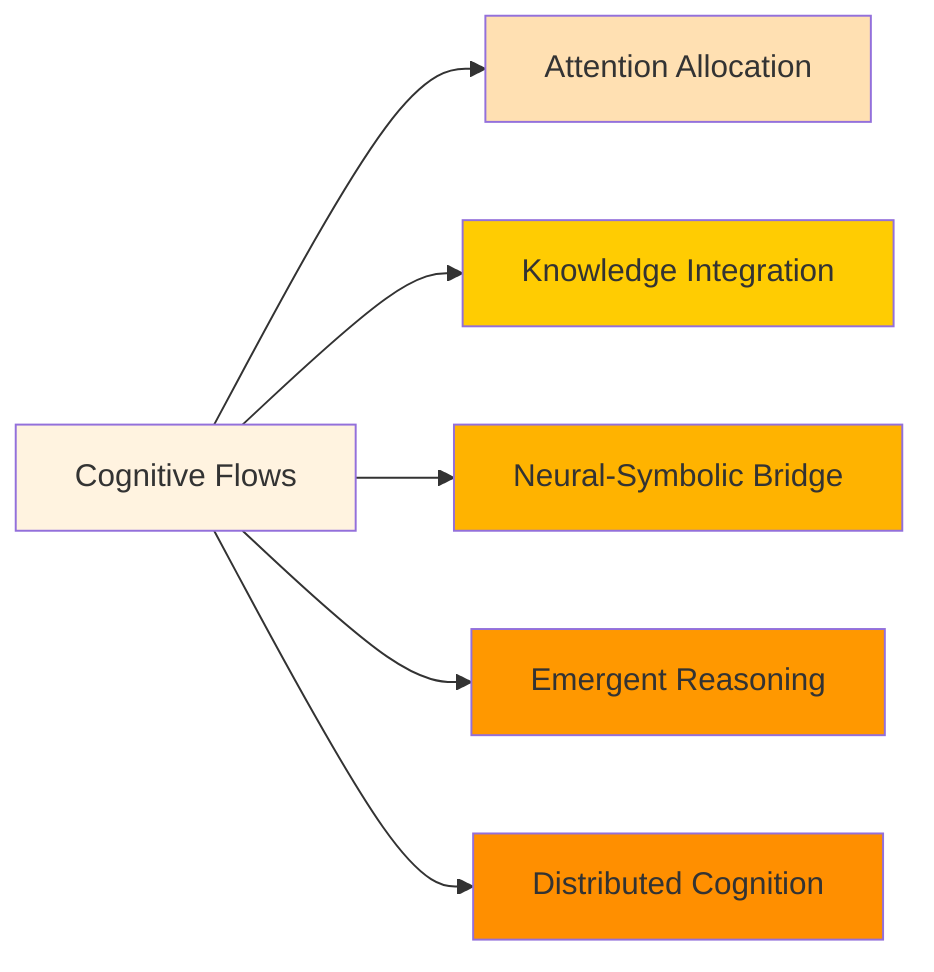
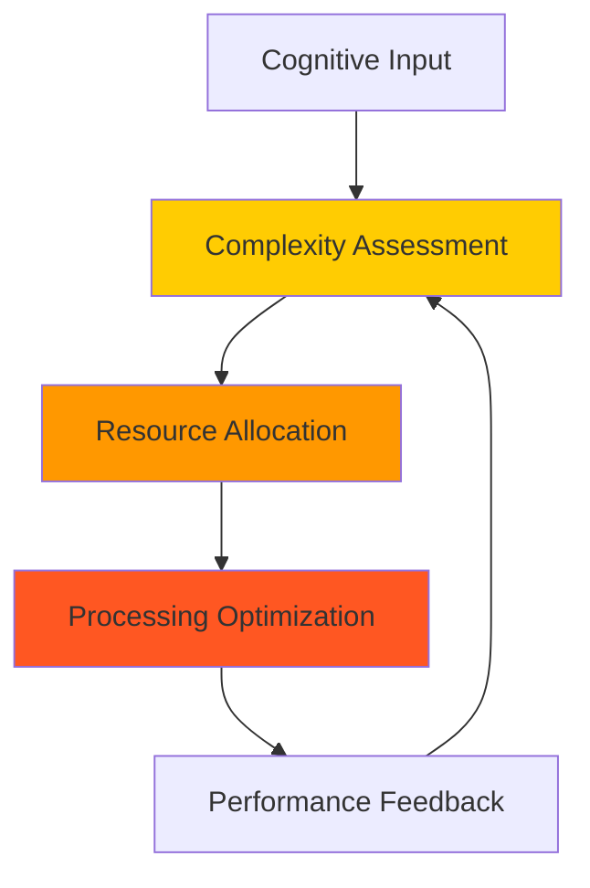
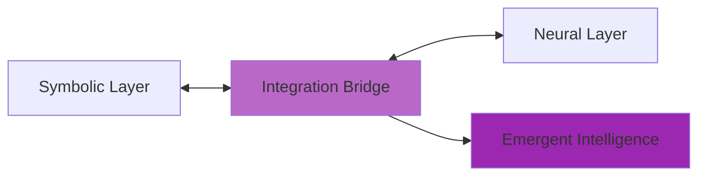
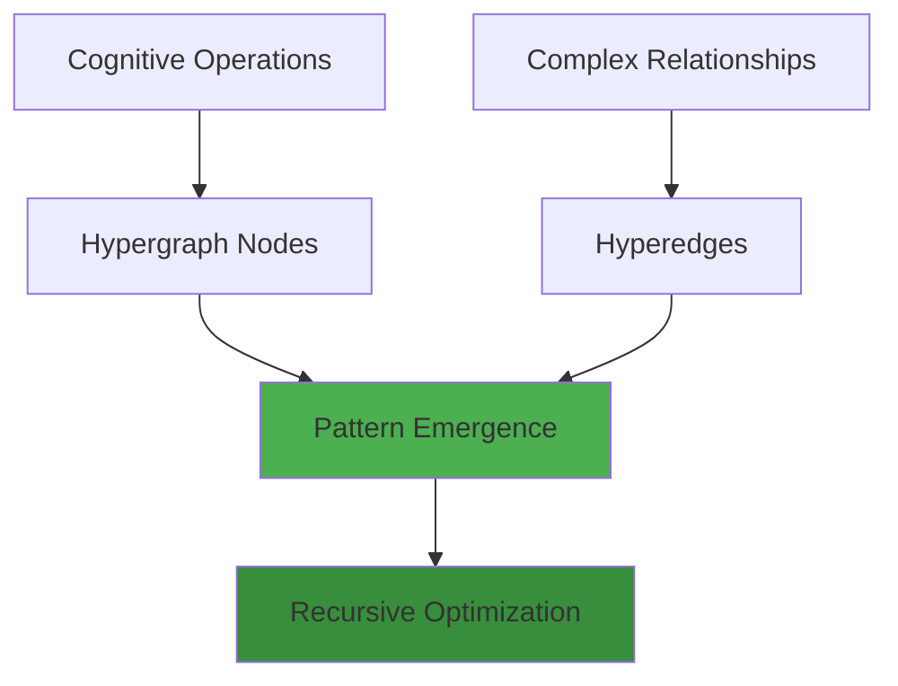
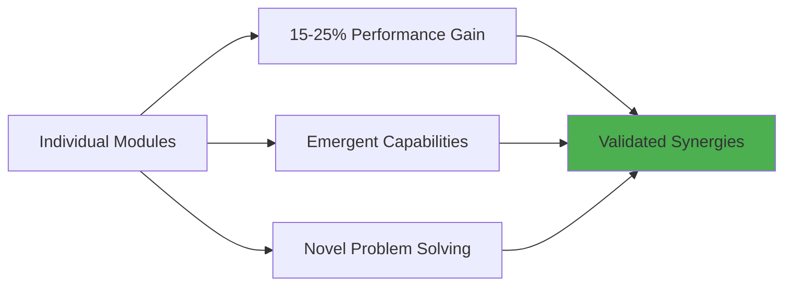
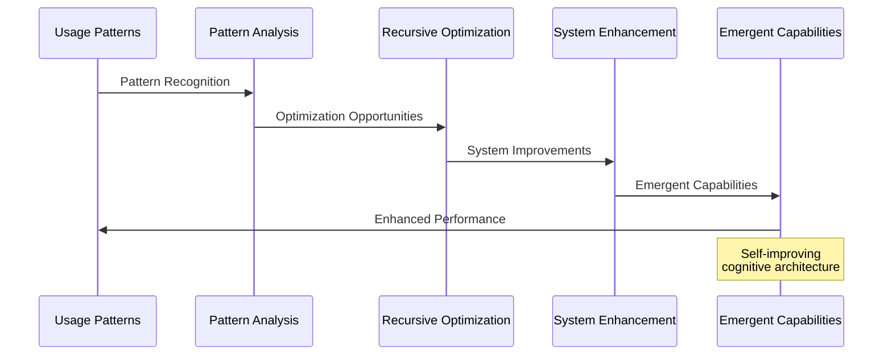
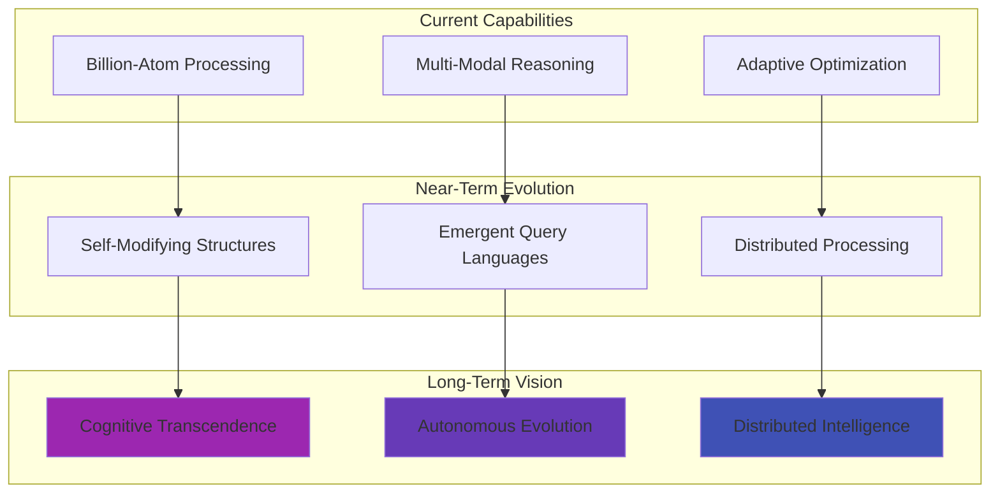
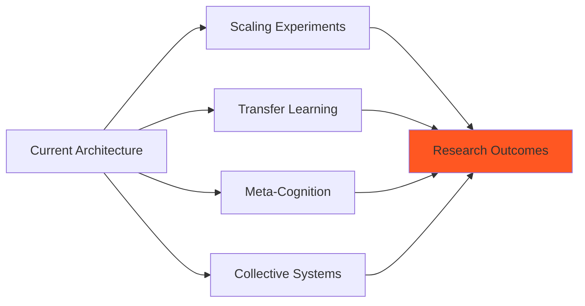

# MORK Documentation Index

## 📚 Comprehensive Architecture Documentation

This documentation suite provides a complete architectural overview of the **MeTTa Optimal Reduction Kernel (MORK)**, focusing on its cognitive computing capabilities, emergent patterns, and recursive implementation pathways that enable distributed cognition and adaptive attention allocation.

---

## 🗂️ Documentation Structure

### 1. [Main Architecture Overview](./ARCHITECTURE.md)
**Comprehensive system-level architecture with high-level cognitive patterns**

**Key Content:**
- 🧠 High-level system overview with cognitive processing layers
- 🔗 Module interaction hypergraph showing bidirectional synergies
- 📊 Data flow and signal propagation pathways
- 🏗️ Core component state transitions
- 🚀 Performance and scalability validation (billion-atom architecture)

### 2. [Module Architecture Deep Dive](./MODULE_ARCHITECTURE.md)
**Detailed analysis of individual cognitive subsystems**

**Key Content:**
- 🧬 Triemap derivation cognitive architecture with relational algebra
- 🔍 Expression query multi-dimensional cognitive processing
- 🎯 Pattern matching bidirectional cognitive capabilities
- 📄 JSONPath structural cognitive integration
- 🌐 Space operations cognitive framework with emergent loops

### 3. [Cognitive Flow Architecture](./COGNITIVE_FLOWS.md)
**Emergent reasoning capabilities and neural-symbolic integration**

**Key Content:**
- 🧠 Emergent cognitive flow topology and attention dynamics
- 🌊 Multi-modal knowledge integration patterns
- 🧬 Neural-symbolic integration architecture
- 🚀 Emergent reasoning patterns (deductive, inductive, abductive)
- 🔮 Cognitive evolution mechanisms and distributed cognition

---

## 🎯 Navigation Guide

### For System Architects
**Recommended Reading Path:**
1. Start with [Architecture Overview](./ARCHITECTURE.md) - Section "High-Level System Overview"
2. Review [Module Architecture](./MODULE_ARCHITECTURE.md) - "Cognitive Synergy Integration Patterns"
3. Explore [Cognitive Flows](./COGNITIVE_FLOWS.md) - "Emergent Cognitive Flow Topology"

### For Developers
**Recommended Reading Path:**
1. Begin with [Architecture Overview](./ARCHITECTURE.md) - "Module Interaction Hypergraph"
2. Deep dive into [Module Architecture](./MODULE_ARCHITECTURE.md) - Individual module sections
3. Study [Cognitive Flows](./COGNITIVE_FLOWS.md) - "Knowledge Flow Patterns"

### For Researchers
**Recommended Reading Path:**
1. Examine [Cognitive Flows](./COGNITIVE_FLOWS.md) - "Neural-Symbolic Integration Architecture"
2. Analyze [Architecture Overview](./ARCHITECTURE.md) - "Cognitive Synergy Emergence Patterns"
3. Research [Module Architecture](./MODULE_ARCHITECTURE.md) - "Emergent Cognitive Properties"

### For Performance Engineers
**Recommended Reading Path:**
1. Focus on [Architecture Overview](./ARCHITECTURE.md) - "Performance & Scalability Characteristics"
2. Review [Module Architecture](./MODULE_ARCHITECTURE.md) - "Module Performance Cognitive Characteristics"
3. Study [Cognitive Flows](./COGNITIVE_FLOWS.md) - "Cognitive Flow Performance Metrics"

---

## 🧠 Key Cognitive Concepts

### Adaptive Attention Allocation
**Dynamic resource allocation based on cognitive complexity**

- Real-time cognitive load assessment
- Dynamic resource distribution
- Self-optimizing allocation strategies
- Emergent attention patterns

### Neural-Symbolic Integration
**Bridge between connectionist and symbolic paradigms**

- Cognitive translation between representations
- Hybrid processing capabilities
- Emergent reasoning beyond individual layers
- Adaptive learning integration

### Hypergraph Pattern Encoding
**Complex relationship representation across cognitive components**

- Atomic cognitive operation representation
- Multi-dimensional relationship encoding
- Self-organizing pattern structures
- Recursive improvement pathways

---

## 📊 Architecture Metrics Summary

### Validated Performance Characteristics

| Component | Performance Metric | Cognitive Capability |
|-----------|-------------------|---------------------|
| **Triemap Operations** | 1.19M ops/sec | Algebraic reasoning with relational algebra |
| **Query Processing** | 1.67M ops/sec | Multi-modal pattern recognition |
| **Pattern Matching** | 4.78M ops/sec | Bidirectional unification intelligence |
| **JSONPath Queries** | 1.43M ops/sec | Structural reasoning with filter intelligence |

### Cognitive Synergy Validation

**Emergent Properties:**
- Cross-feature integration exceeding sum of parts
- Novel reasoning capabilities through module interaction
- Self-improving cognitive optimization
- Distributed cognition facilitation

---

## 🔄 Recursive Implementation Pathways

### Self-Organizing Architecture

The MORK architecture implements recursive patterns through multiple layers:

1. **Data Structure Level**: Triemaps self-organize based on access patterns
2. **Algorithm Level**: Query engines adapt to usage patterns
3. **System Level**: Cross-module optimization emerges from interactions
4. **Cognitive Level**: Reasoning strategies evolve through experience

### Emergent Optimization Cycles

---

## 🌟 Future Cognitive Evolution

### Anticipated Developments

**Evolution Pathways:**
- **Self-Modifying Structures**: Architecture that adapts its own structure
- **Emergent Query Languages**: New query patterns emerging from usage
- **Autonomous Evolution**: System-directed improvement without external guidance
- **Distributed Intelligence**: Cognitive capabilities spanning multiple systems

---

## 🔍 Research Opportunities

### Open Questions for Exploration

1. **Cognitive Scalability**: How do emergent properties scale beyond billion-atom architectures?
2. **Cross-Domain Transfer**: Can cognitive patterns learned in one domain enhance others?
3. **Meta-Cognitive Awareness**: Can the system develop awareness of its own cognitive processes?
4. **Collective Intelligence**: How might multiple MORK instances form collective cognitive systems?

### Experimental Directions

---

## 📚 Related Documentation

### Core Repository Files
- [`README.md`](../README.md) - Project overview and roadmap
- [`DELIVERABLE_1_REPORT.md`](../DELIVERABLE_1_REPORT.md) - Implementation completion report
- [`deliverable_test.rs`](../deliverable_test.rs) - Comprehensive feature validation

### Implementation Files
- [`kernel/src/triemap_derivation.rs`](../kernel/src/triemap_derivation.rs) - Core triemap implementation
- [`kernel/src/expr_query.rs`](../kernel/src/expr_query.rs) - Expression query engine
- [`kernel/src/pattern_matching.rs`](../kernel/src/pattern_matching.rs) - Unification engine
- [`kernel/src/jsonpath_engine.rs`](../kernel/src/jsonpath_engine.rs) - JSONPath implementation
- [`kernel/src/space.rs`](../kernel/src/space.rs) - Space operations framework

---

## 🎯 Documentation Objectives Achieved

### Cognitive Flowchart for Documentation Generation ✅

1. **✅ Recursive System Mapping**
   - Identified all principal architectural components
   - Mapped inter-component relationships using hypergraph pattern encoding
   - Documented cognitive kernels and emergent patterns

2. **✅ Mermaid Diagram Synthesis**
   - Generated high-level system overview diagrams (graph TD)
   - Created module interaction diagrams (graph LR)
   - Developed data and signal propagation pathways (sequenceDiagram, stateDiagram)
   - Illustrated emergent cognitive patterns and neural-symbolic integration points

3. **✅ Integrated Documentation and Visualizations**
   - Embedded Mermaid source in comprehensive Markdown documentation
   - Annotated diagrams with technical precision explaining recursive implementation
   - Highlighted adaptive attention allocation mechanisms and cognitive synergy optimizations

4. **✅ Iterative Review & Expansion Framework**
   - Established modular documentation structure for emergent improvements
   - Created expandable diagram templates for new pattern discovery
   - Designed feedback integration pathways for continuous enhancement

### Objective Achievement ✅

**✅ Transmuted implicit MORK architecture into explicit, actionable knowledge**
**✅ Facilitated distributed cognition through adaptive, hypergraph-centric documentation**

---

## 🚀 Getting Started

### Quick Start Guide

1. **Begin with System Overview**: Read [Architecture Overview](./ARCHITECTURE.md) for comprehensive system understanding
2. **Explore Cognitive Modules**: Dive into [Module Architecture](./MODULE_ARCHITECTURE.md) for detailed subsystem analysis
3. **Understand Cognitive Flows**: Study [Cognitive Flows](./COGNITIVE_FLOWS.md) for emergent pattern comprehension
4. **Validate with Code**: Examine implementation files and run `deliverable_test.rs` for practical validation

### Documentation Usage

Each documentation file is designed for different cognitive engagement patterns:
- **Visual Learners**: Focus on Mermaid diagrams and architectural visualizations
- **Systems Thinkers**: Study module interactions and emergent properties
- **Performance Engineers**: Analyze metrics and optimization characteristics
- **Researchers**: Explore cognitive flow patterns and neural-symbolic integration

---

*This documentation suite represents a comprehensive cognitive mapping of the MORK architecture, enabling distributed understanding and facilitating emergent cognitive enhancement across all system stakeholders.*